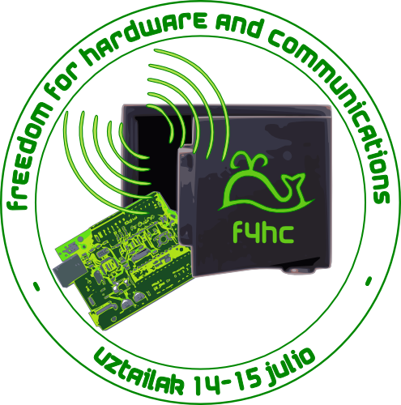

# Freedom for Hardware & Communications

> [2011ko] Uztailaren 14 eta 15ean, itsas-ek, unibertsitate mailan software librea, estandar irekiak eta kultura librearen idealak bultzatu nahi dituen UPV/EHU-ko Software Libre Taldeak, [Bizkaia Aretoa](https://www.ehu.eus/eu/web/bizkaia-aretoa)n, [Bilbo](http://www.bilbao.net/)n antolaturiko f4hc, Freedom for Hardware & Communications jardunaldiak burutu ziren. f4hc-ren helburuak hurrengoak izan ziren:
>
> - Hardware askearen eta telekomunikazioen arloan erabilitako software askearen berrikuntzen eta arrakasten erakustokia izatea.
> - Hardware eta software askearekiko interesa sustatzea, IKT-en arloko enpresetan eta UPV/EHUko ikasle eta irakasleengan.
> - Enpresek elkarrekin eta ikasleriaren komunikatzeko bidea izatea, software askeak bertoko ekonomia eta ezagutza unibertsala bultzatzeko duen ahalmena azpimarratzea.
>
> Itsaseko partaideok [UPV/EHUko Bizkaiko Campusa](https://www.ehu.eus/es/web/bizkaia)-k eta [Cenatic](http://www.cenatic.es/)-ek eskainitako babesa eskertu nahi dugu.

  

>  Durante los días jueves 14 y viernes 15 de julio [de 2011] tuvieron lugar en el [Bizkaia Aretoa](https://www.ehu.eus/eu/web/bizkaia-aretoa) de [Bilbao](http://www.bilbao.net/) las jornadas f4hc, Freedom for Hardware & Communications, organizadas por **itsas**, grupo promotor del software y las tecnologías libres en el ámbito de la [UPV/EHU](http://www.ehu.es/). Los objetivos de f4hc fueron:
>
> - Ser un escaparate en el cual mostrar casos de éxito y novedades en tecnologías relacionadas con hardware libre así como software libre empleado en dispositivos y soluciones del ámbito de las telecomunicaciones.
> - Fomentar el interés por el hardware y software libres, tanto en empresas del sector de las TICs como en el alumnado y profesorado de la UPV/EHU.
> - Ser un canal de contacto entre empresas, y de éstas con el alumnado, a fin de resaltar el papel del software libre como motor potencial para la economía local y el conocimiento universal.
>
> Desde **itsas** queremos agradecer el patrocinio al [Campus de Bizkaia de la UPV/EHU](https://www.ehu.eus/es/web/bizkaia) y al [Cenatic](http://www.cenatic.es/).
